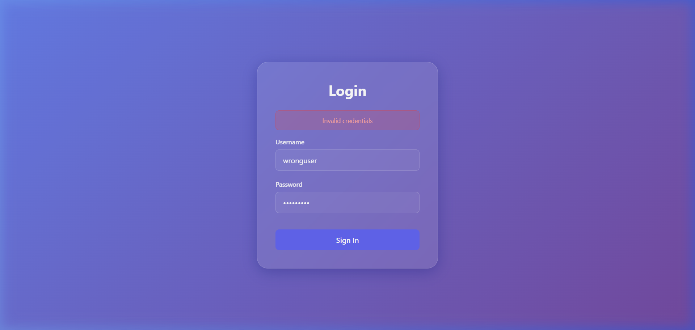
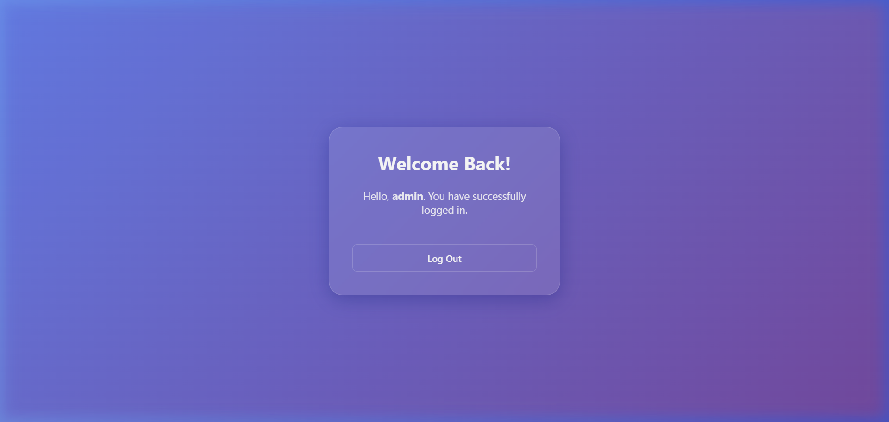
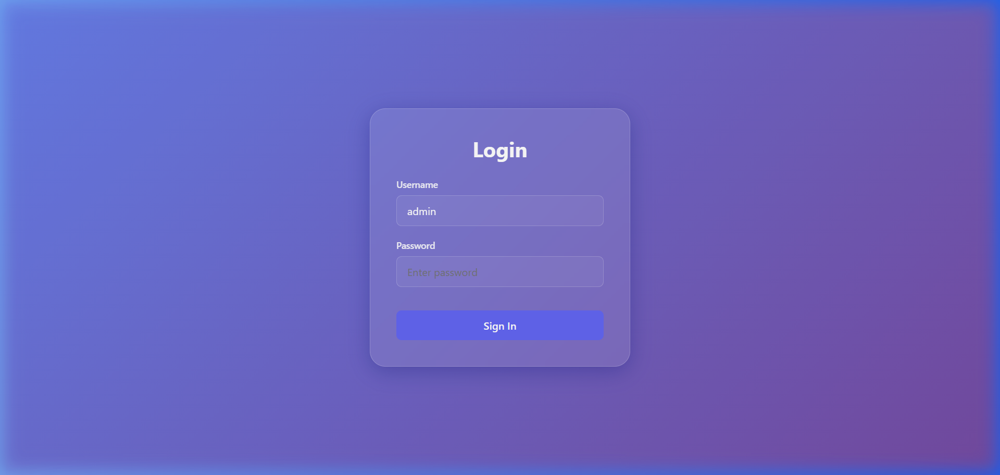

# Login Application (React + Node.js)

A full-stack Login Application built with **React** (frontend) and **Node.js with Express** (backend).

## 🎬 Demo

### Scenario 1: Invalid Credentials


### Scenario 2: Successful Login → Welcome Page


### Scenario 3: Remember Username After Logout


## Features

- 🔐 Login page with username and password fields
- 🛡️ Backend API (`POST /login`) that validates credentials
- ✅ Successful login (`admin/admin`) navigates to a Welcome page
- ❌ Incorrect credentials display an appropriate error message
- 💾 Remembers username after successful login for subsequent logins
- 🎨 Modern glassmorphism UI design with smooth animations

## Tech Stack

- **Frontend**: React (Vite), React Router, Axios, Vanilla CSS
- **Backend**: Node.js, Express, CORS

## Project Structure

```
login-app/
├── backend/
│   ├── server.js          # Express server with login API
│   ├── package.json
│   └── node_modules/
├── frontend/
│   ├── src/
│   │   ├── App.jsx        # React components (Login, Welcome, ProtectedRoute)
│   │   ├── index.css      # Glassmorphism styling
│   │   └── main.jsx       # App entry point
│   ├── package.json
│   └── node_modules/
├── demo/                  # Demo screenshots
├── .gitignore
└── README.md
```

## Getting Started

### Prerequisites

- Node.js (v16+)
- npm

### Installation & Running

1. **Clone the repository**
   ```bash
   git clone https://github.com/KalyanRamGoparaboina/Ominitus.git
   cd Ominitus
   ```

2. **Start the Backend**
   ```bash
   cd backend
   npm install
   npm start
   ```
   The server runs on `http://localhost:5000`

3. **Start the Frontend** (in a new terminal)
   ```bash
   cd frontend
   npm install
   npm run dev
   ```
   The app runs on `http://localhost:5173`

## Test Credentials

| Username | Password | Result        |
|----------|----------|---------------|
| admin    | admin    | ✅ Welcome Page |
| other    | other    | ❌ Error Message |

## API Endpoints

### POST `/login`

**Request Body:**
```json
{
  "username": "admin",
  "password": "admin"
}
```

**Responses:**
| Status Code | Description              |
|-------------|--------------------------|
| 200         | Login successful          |
| 401         | Invalid credentials       |
| 400         | Missing username/password |

## Implementation Details

- **Functional Components** with React Hooks (`useState`, `useEffect`, `useNavigate`)
- **Protected Routes** using a `ProtectedRoute` wrapper component
- **Axios** for API integration
- **localStorage** for remembering username across sessions
